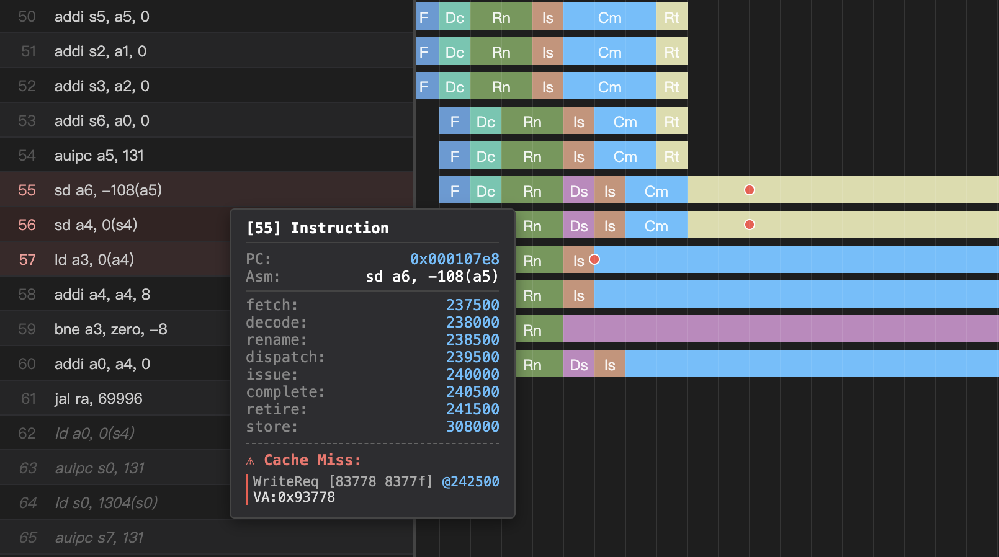

## PipeView

---



* O3CPU pipeline visualizer for O3PipeView formats
* identify pipeline events including cache miss

### Usage

#### Modify Gem5

```c++
// mem/base.cc
// bool BaseCache::access(PacketPtr pkt, CacheBlk *&blk, Cycles &lat, PacketList &writebacks)
// after blk = tags->accessBlock(pkt, tag_latency);
DPRINTFR(O3PipeView, "O3PipeView:cache:%llu:%s:%#x:%#x:%s:%s\n",
            accessTick,
            pkt->print(), 
            pkt->req->getVaddr(), pkt->req->getPaddr(),
            pkt->req->hasInstSeqNum() ? "sn:" + std::to_string(pkt->req->getReqInstSeqNum()) : "pc:" + std::to_string(pkt->req->getPC()),
            blk ? "hit " : "miss")
```

#### RUN

```sh
build/RISCV/gem5.opt --debug-flags=O3PipeView --debug-file=trace_pipe.out configs/deprecated/example/se.py --cmd=tests/test-progs/hello/bin/riscv/linux/hello --cpu-type=DerivO3CPU --caches

pip install -r requirements.txt
python app.py
```

